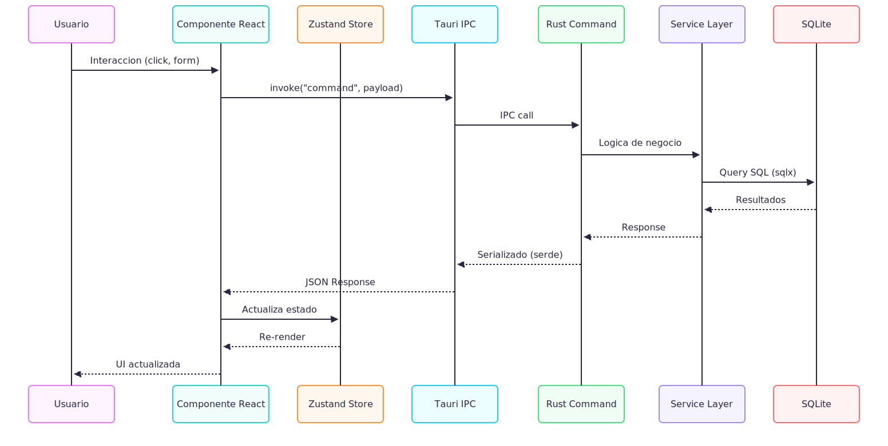

# Arquitectura del Sistema

## Vista general



## Tech Stack detallado

### Backend (Rust)
| Crate | Proposito |
|-------|-----------|
| `tauri` v2 | Framework de desktop app |
| `sqlx` | Queries SQL async con verificacion en compilacion |
| `serde` | Serializacion/deserializacion JSON |
| `chrono` | Manejo de fechas y tiempos |
| `uuid` | Generacion de IDs unicos |
| `rust_decimal` | Aritmetica decimal precisa para montos financieros |

**Importante**: Nunca usar `f64` para montos monetarios. Siempre `rust_decimal::Decimal` o almacenar como integers (centavos/unidad minima).

### Frontend (React + TypeScript)
| Paquete | Proposito |
|---------|-----------|
| `react` v19 | UI framework |
| `typescript` | Type safety |
| `@tauri-apps/api` | Comunicacion con backend Rust |
| `d3` | Graficos y visualizaciones |
| `zustand` | State management |
| `tailwindcss` v4 | Utility-first CSS |
| `react-router` | Navegacion entre paginas |
| `react-hook-form` | Manejo de formularios |
| `zod` | Validacion de schemas |

## Estructura del proyecto

```
Necronomics/
├── src-tauri/                   # Backend Rust
│   ├── src/
│   │   ├── main.rs              # Entry point Tauri
│   │   ├── lib.rs               # Registro de comandos y setup
│   │   ├── commands/            # Handlers IPC (lo que el frontend invoca)
│   │   │   ├── mod.rs
│   │   │   ├── transactions.rs
│   │   │   ├── categories.rs
│   │   │   ├── accounts.rs
│   │   │   ├── debts.rs
│   │   │   ├── exchange.rs
│   │   │   └── export.rs
│   │   ├── db/                  # Capa de base de datos
│   │   │   ├── mod.rs
│   │   │   ├── models.rs        # Structs que mapean tablas
│   │   │   ├── queries/         # Funciones SQL por entidad
│   │   │   └── migrations/      # Archivos .sql de migracion
│   │   └── services/            # Logica de negocio
│   │       ├── mod.rs
│   │       ├── transaction_service.rs
│   │       ├── debt_service.rs
│   │       ├── exchange_service.rs
│   │       └── export_service.rs
│   ├── Cargo.toml
│   └── tauri.conf.json
│
├── src/                         # Frontend React
│   ├── components/
│   │   ├── ui/                  # Componentes base reutilizables
│   │   │   ├── Button.tsx
│   │   │   ├── Input.tsx
│   │   │   ├── Select.tsx
│   │   │   ├── Modal.tsx
│   │   │   ├── Table.tsx
│   │   │   └── Card.tsx
│   │   ├── transactions/        # Componentes de transacciones
│   │   ├── dashboard/           # Widgets del dashboard
│   │   ├── debts/               # Componentes de deudas
│   │   └── layout/              # Shell, Sidebar, Header
│   ├── pages/                   # Paginas/rutas principales
│   │   ├── DashboardPage.tsx
│   │   ├── TransactionsPage.tsx
│   │   ├── DebtsPage.tsx
│   │   └── SettingsPage.tsx
│   ├── hooks/                   # Custom hooks
│   ├── stores/                  # Zustand stores
│   │   ├── transactionStore.ts
│   │   ├── debtStore.ts
│   │   └── settingsStore.ts
│   ├── lib/                     # Utilidades y helpers
│   │   ├── tauri.ts             # Wrapper de invoke commands
│   │   ├── formatters.ts        # Formateo de moneda, fechas
│   │   └── constants.ts
│   ├── types/                   # Tipos TypeScript compartidos
│   │   └── index.ts
│   ├── styles/                  # CSS custom y tema
│   │   ├── globals.css
│   │   ├── retro.css            # Efectos retro 2000s
│   │   └── lovecraft.css        # Efectos tematicos especificos
│   ├── App.tsx
│   └── main.tsx
│
├── docs/                        # Documentacion del proyecto
├── public/                      # Assets estaticos
│   └── assets/
│       ├── fonts/
│       └── images/
├── package.json
├── tsconfig.json
├── vite.config.ts
├── tailwind.config.ts
└── CLAUDE.md
```

## Flujo de datos



## Seguridad

- **Tauri CSP**: Content Security Policy estricta configurada en `tauri.conf.json`
- **Allowlist**: Solo los comandos IPC necesarios estan expuestos al frontend
- **SQL Injection**: Imposible gracias a queries parametrizados de sqlx
- **Sin red**: La app no hace peticiones HTTP (excepto si se agrega sync de tipo de cambio en el futuro)
- **Datos locales**: Todo en SQLite dentro del directorio de datos del usuario
