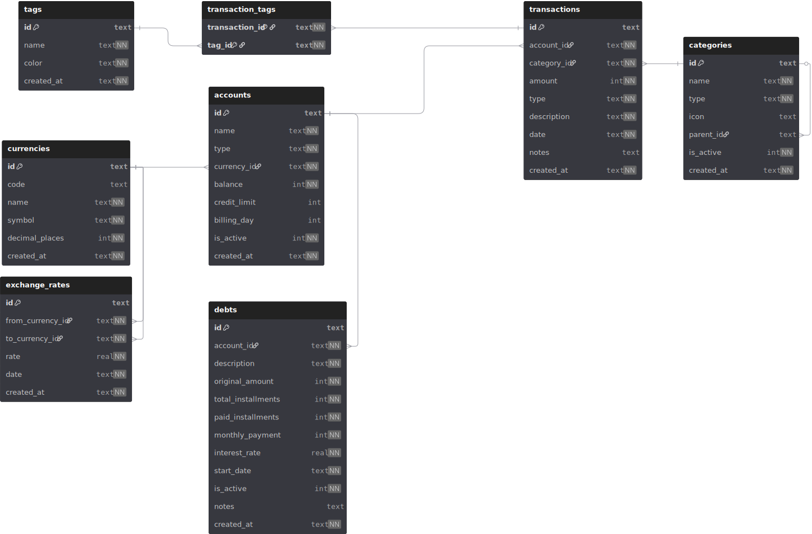

# Esquema de Base de Datos

## Diagrama de entidades



## Tablas

### currencies
Monedas soportadas por el sistema (CLP, USD, EUR, JPY, CNY).

```sql
CREATE TABLE currencies (
    id TEXT PRIMARY KEY,          -- UUID
    code TEXT NOT NULL UNIQUE,     -- 'CLP', 'USD', etc.
    name TEXT NOT NULL,            -- 'Peso Chileno', 'US Dollar'
    symbol TEXT NOT NULL,          -- '$', 'US$', 'E', 'Y', 'Y'
    decimal_places INTEGER NOT NULL DEFAULT 2,  -- CLP=0, USD=2, JPY=0
    created_at TEXT NOT NULL DEFAULT (datetime('now'))
);
```

**Seed data:**
| code | name | symbol | decimal_places |
|------|------|--------|---------------|
| CLP | Peso Chileno | $ | 0 |
| USD | US Dollar | US$ | 2 |
| EUR | Euro | EUR | 2 |
| JPY | Yen Japones | JPY | 0 |
| CNY | Yuan Chino | CNY | 2 |

### accounts
Cuentas del usuario (efectivo, cuentas bancarias, tarjetas de credito).

```sql
CREATE TABLE accounts (
    id TEXT PRIMARY KEY,
    name TEXT NOT NULL,
    type TEXT NOT NULL CHECK (type IN ('cash', 'bank', 'credit_card')),
    currency_id TEXT NOT NULL REFERENCES currencies(id),
    balance INTEGER NOT NULL DEFAULT 0,       -- En unidad minima (ej: centavos)
    credit_limit INTEGER,                      -- Solo para credit_card
    billing_day INTEGER CHECK (billing_day BETWEEN 1 AND 31),  -- Dia de facturacion
    is_active INTEGER NOT NULL DEFAULT 1,
    created_at TEXT NOT NULL DEFAULT (datetime('now'))
);
```

**Nota sobre montos**: Todos los montos se almacenan como INTEGER en la unidad minima de la moneda. Para CLP y JPY (0 decimales) se almacena el valor directo. Para USD, EUR, CNY se almacena en centavos (ej: $10.50 = 1050).

### categories
Categorias jerarquicas para clasificar transacciones.

```sql
CREATE TABLE categories (
    id TEXT PRIMARY KEY,
    name TEXT NOT NULL,
    type TEXT NOT NULL CHECK (type IN ('income', 'expense')),
    icon TEXT,                                  -- Nombre de icono o emoji
    parent_id TEXT REFERENCES categories(id),   -- NULL = categoria raiz
    is_active INTEGER NOT NULL DEFAULT 1,
    created_at TEXT NOT NULL DEFAULT (datetime('now')),
    UNIQUE(name, parent_id, type)
);
```

**Ejemplo de jerarquia:**
```
Alimentacion (expense)
  ├── Supermercado
  ├── Comida Rapida
  ├── Restaurant
  └── Delivery

Transporte (expense)
  ├── Micro/Metro
  ├── Uber/Taxi
  └── Bencina

Sueldo (income)
  ├── Sueldo Base
  ├── Bonos
  └── Horas Extra
```

### transactions
Tabla central: cada ingreso y gasto registrado.

```sql
CREATE TABLE transactions (
    id TEXT PRIMARY KEY,
    account_id TEXT NOT NULL REFERENCES accounts(id),
    category_id TEXT NOT NULL REFERENCES categories(id),
    amount INTEGER NOT NULL,                    -- Siempre positivo, en unidad minima
    type TEXT NOT NULL CHECK (type IN ('income', 'expense')),
    description TEXT NOT NULL,                  -- "Completo", "Sueldo Enero", etc.
    date TEXT NOT NULL,                         -- ISO 8601: YYYY-MM-DD
    notes TEXT,                                 -- Notas opcionales
    created_at TEXT NOT NULL DEFAULT (datetime('now'))
);

CREATE INDEX idx_transactions_date ON transactions(date);
CREATE INDEX idx_transactions_category ON transactions(category_id);
CREATE INDEX idx_transactions_account ON transactions(account_id);
CREATE INDEX idx_transactions_type ON transactions(type);
CREATE INDEX idx_transactions_description ON transactions(description);
```

### tags
Etiquetas adicionales para mayor granularidad en la clasificacion.

```sql
CREATE TABLE tags (
    id TEXT PRIMARY KEY,
    name TEXT NOT NULL UNIQUE,
    color TEXT NOT NULL DEFAULT '#4a5d23',       -- Color hex para UI
    created_at TEXT NOT NULL DEFAULT (datetime('now'))
);
```

### transaction_tags
Relacion muchos-a-muchos entre transacciones y tags.

```sql
CREATE TABLE transaction_tags (
    transaction_id TEXT NOT NULL REFERENCES transactions(id) ON DELETE CASCADE,
    tag_id TEXT NOT NULL REFERENCES tags(id) ON DELETE CASCADE,
    PRIMARY KEY (transaction_id, tag_id)
);
```

### debts
Deudas en cuotas (compras con tarjeta de credito, prestamos, etc.).

```sql
CREATE TABLE debts (
    id TEXT PRIMARY KEY,
    account_id TEXT NOT NULL REFERENCES accounts(id),
    description TEXT NOT NULL,
    original_amount INTEGER NOT NULL,           -- Monto total original
    total_installments INTEGER NOT NULL,        -- Total de cuotas
    paid_installments INTEGER NOT NULL DEFAULT 0,
    monthly_payment INTEGER NOT NULL,           -- Monto de cada cuota
    interest_rate REAL NOT NULL DEFAULT 0.0,    -- Tasa de interes mensual (%)
    start_date TEXT NOT NULL,                   -- Fecha primera cuota
    is_active INTEGER NOT NULL DEFAULT 1,
    notes TEXT,
    created_at TEXT NOT NULL DEFAULT (datetime('now'))
);

CREATE INDEX idx_debts_account ON debts(account_id);
CREATE INDEX idx_debts_active ON debts(is_active);
```

### exchange_rates
Tipos de cambio entre monedas.

```sql
CREATE TABLE exchange_rates (
    id TEXT PRIMARY KEY,
    from_currency_id TEXT NOT NULL REFERENCES currencies(id),
    to_currency_id TEXT NOT NULL REFERENCES currencies(id),
    rate REAL NOT NULL,                         -- 1 from = rate to
    date TEXT NOT NULL,                         -- YYYY-MM-DD
    created_at TEXT NOT NULL DEFAULT (datetime('now')),
    UNIQUE(from_currency_id, to_currency_id, date)
);

CREATE INDEX idx_exchange_rates_date ON exchange_rates(date);
```

### recurring_transactions
Reglas de transacciones recurrentes (se procesan al iniciar la app).

```sql
CREATE TABLE recurring_transactions (
    id TEXT PRIMARY KEY,
    account_id TEXT NOT NULL REFERENCES accounts(id),
    category_id TEXT NOT NULL REFERENCES categories(id),
    amount INTEGER NOT NULL,
    type TEXT NOT NULL CHECK (type IN ('income', 'expense')),
    description TEXT NOT NULL,
    frequency TEXT NOT NULL CHECK (frequency IN ('weekly', 'biweekly', 'monthly')),
    next_date TEXT NOT NULL,                    -- YYYY-MM-DD, proxima fecha de ejecucion
    is_active INTEGER NOT NULL DEFAULT 1,
    created_at TEXT NOT NULL DEFAULT (datetime('now'))
);

CREATE INDEX idx_recurring_active_date ON recurring_transactions(is_active, next_date);
```

## Estrategia de migraciones

Usamos archivos SQL numerados en `src-tauri/src/db/migrations/`:

```
migrations/
├── 001_initial_schema.sql
├── 002_seed_currencies.sql
└── ...
```

Ejecutados secuencialmente al iniciar la app. Se mantiene una tabla interna `_migrations` para tracking:

```sql
CREATE TABLE IF NOT EXISTS _migrations (
    id INTEGER PRIMARY KEY AUTOINCREMENT,
    name TEXT NOT NULL UNIQUE,
    applied_at TEXT NOT NULL DEFAULT (datetime('now'))
);
```

## Queries clave para autocomplete

El autocomplete de descripciones se basa en frecuencia de uso:

```sql
-- Sugerencias basadas en descripcion + categoria
SELECT description, category_id, COUNT(*) as frequency
FROM transactions
WHERE description LIKE ? || '%'
GROUP BY description, category_id
ORDER BY frequency DESC
LIMIT 10;
```
